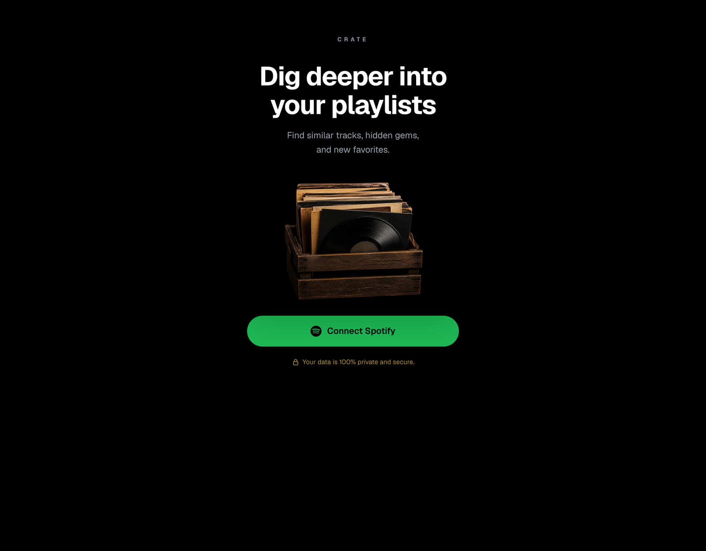
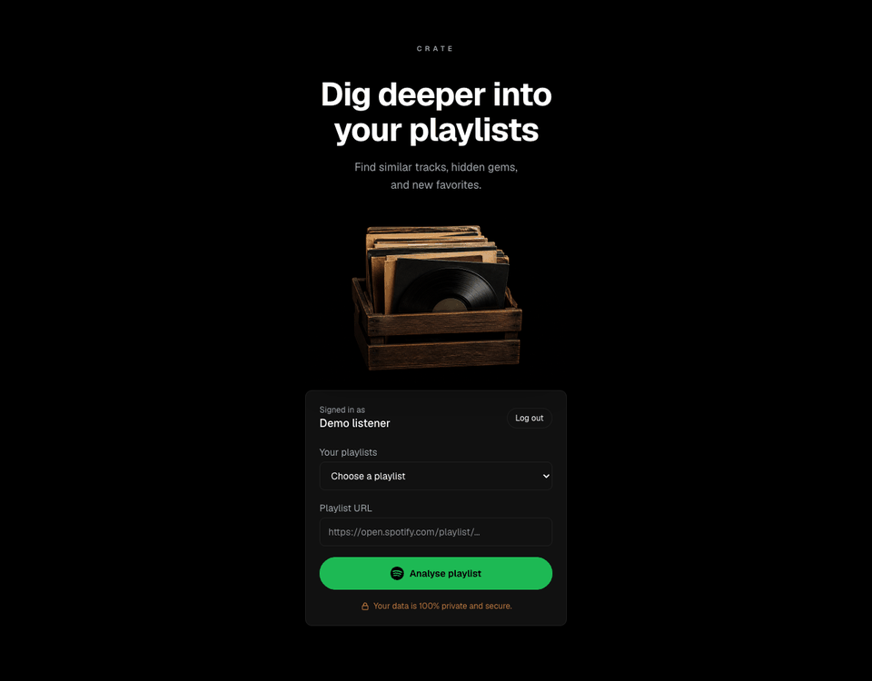
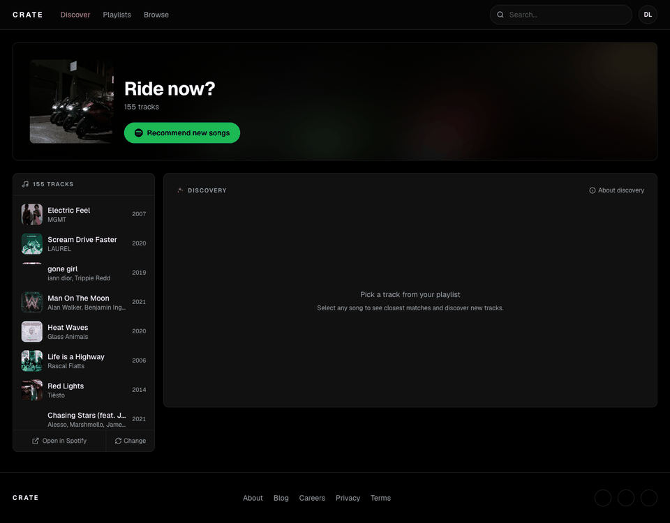
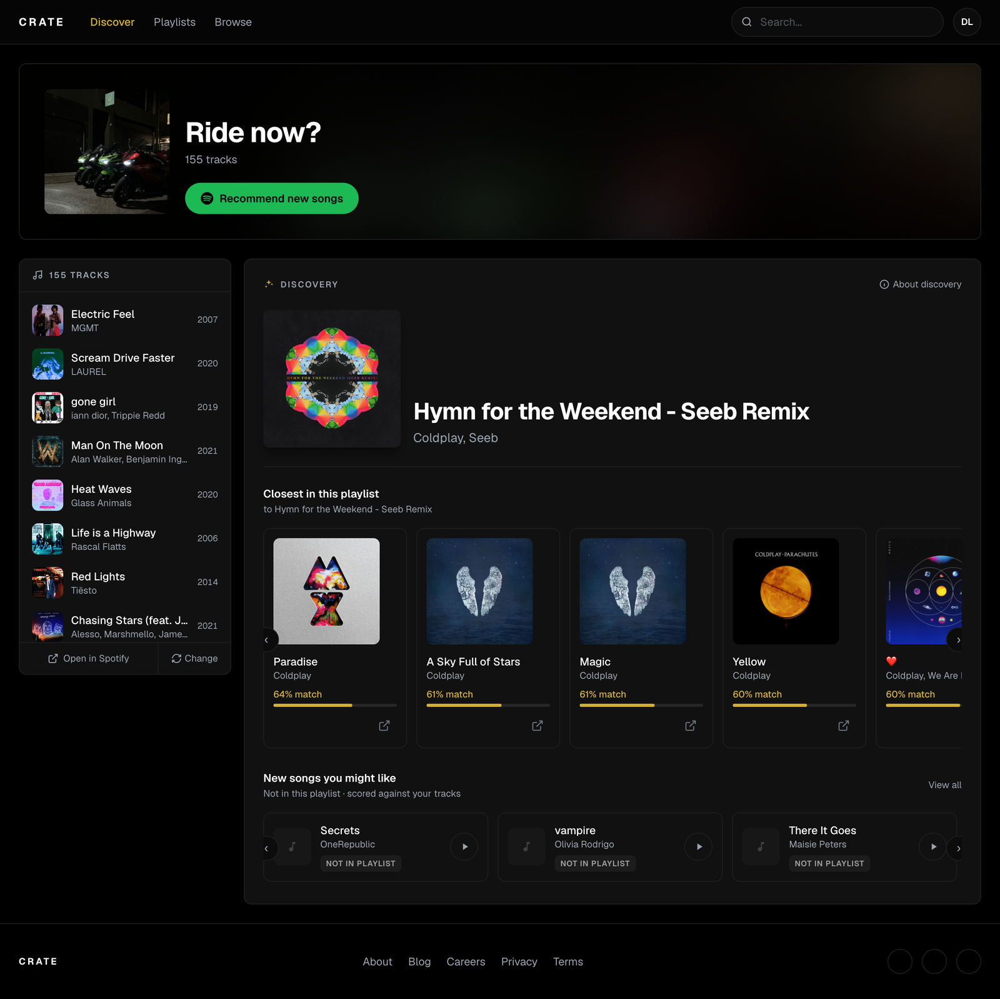
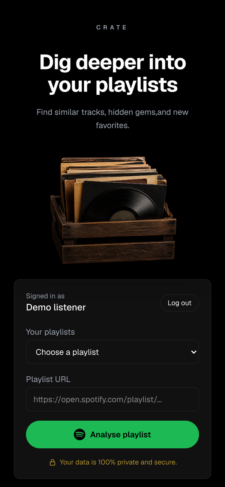
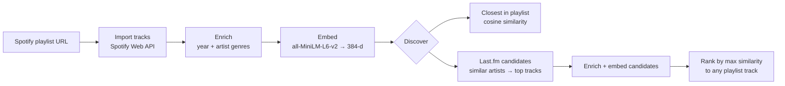

<div align="center">

# Crate

**Dig deeper into your playlists.**

Crate is a music discovery app that reads one of your Spotify playlists, works out what each track "is" with sentence embeddings, and uses that to find the closest tracks inside the playlist and new songs outside it.

[**Live app →**](https://crate-music-theta.vercel.app)




</div>

---

## Demo

### Analyse a playlist

Sign in with Spotify, pick one of your playlists or paste its URL, and hit **Analyse**. Crate loads every track (paging through Spotify in parallel), adds release years and artist genres, then builds a similarity index in the background. You can browse the tracklist while the index builds.

<p align="center"></p>

### Find similar tracks and new songs

Click any track to see its **closest matches in the playlist**, ranked by cosine similarity. Then hit **Recommend new songs** to pull candidates from Last.fm. Crate filters out anything already in the playlist and scores the rest against your tracks.

<p align="center"></p>

<details>
<summary><b>More screenshots</b></summary>
<br>

| Full discovery view | Mobile |
|---|---|
|  |  |

**Signed in, choosing a playlist**


</details>

> The demo above runs the real frontend against a recorded playlist session. Spotify API Dev Mode only lets allow-listed accounts sign in to the live app.

---

## Features

- **Spotify login (OAuth)**: lists the playlists you own or collaborate on, or takes any playlist URL.
- **Fast import**: fetches track pages concurrently, then enriches each track with release year and artist genres. Artist lookups are cached on disk.
- **Background indexing**: embeddings are built off the request path, and the UI polls `/spotify/playlist/status` until the index is ready.
- **Closest in this playlist**: picks any track and returns its top 5 nearest neighbours with a match %.
- **New songs you might like**: seeds Last.fm from your most frequent artists, expands through similar artists and their top tracks, removes tracks you already have, and ranks the top 10 by similarity to your playlist.
- **Session restore**: refresh the page and your playlist, last selection and recommendations come back.
- **Responsive UI**: a dark, Spotify-flavoured layout with album art, similarity bars and horizontal carousels that works down to phone width.

## How it works



Each track is turned into a fixed-shape text block and embedded with [`all-MiniLM-L6-v2`](https://huggingface.co/sentence-transformers/all-MiniLM-L6-v2):

```text
artist: Coldplay, Seeb
track: Hymn for the Weekend - Seeb Remix
album: Hymn for the Weekend (Seeb Remix)
year: 2016
genres:
```

Missing fields stay empty rather than changing the template, so every track is described the same way. Spotify often returns no artist genres for Dev Mode apps.

Vectors are L2-normalised, so similarity is just a dot product. A recommendation's score is its **highest** similarity to any track in your playlist, which means a song that strongly matches one corner of a mixed playlist can still rank well.

This is metadata similarity, not audio or lyrics. See [`docs/embeddings.md`](docs/embeddings.md) for the full explanation.

## Tech stack

| Layer | Tools |
|---|---|
| Frontend | Next.js 16 (App Router), React 19, TypeScript, Tailwind CSS 4 |
| Backend | Python 3.11, FastAPI, httpx (async), NumPy |
| ML | sentence-transformers (`all-MiniLM-L6-v2`), runs on CPU |
| Data | Spotify Web API (auth, playlists, artists), Last.fm API (similar artists, top tracks) |
| Hosting | Vercel (frontend) + Railway (API). See [`docs/deploy.md`](docs/deploy.md) |

## Getting started

### Prerequisites

- Node.js 20+
- Python 3.11+
- A [Spotify Developer app](https://developer.spotify.com/dashboard) with redirect URI `http://127.0.0.1:8000/auth/spotify/callback`
- A [Last.fm API key](https://www.last.fm/api/account/create) (only needed for recommendations)

### 1. Backend

```bash
cd backend
python -m venv .venv
source .venv/bin/activate
pip install -r requirements.txt
```

Create `backend/.env`:

```env
SPOTIFY_CLIENT_ID=your_client_id
SPOTIFY_CLIENT_SECRET=your_client_secret
SPOTIFY_REDIRECT_URI=http://127.0.0.1:8000/auth/spotify/callback
FRONTEND_URL=http://localhost:3000
LASTFM_API_KEY=your_lastfm_key
```

```bash
uvicorn app.main:app --reload
```

The API runs on `http://127.0.0.1:8000`. On first start it downloads the MiniLM model (about 90 MB) into `backend/.cache/`.

### 2. Frontend

```bash
cd frontend
npm install
npm run dev
```

Open `http://localhost:3000`. Set `NEXT_PUBLIC_API_URL` if the API is somewhere other than `http://127.0.0.1:8000`.

## API

| Method | Path | Description |
|---|---|---|
| `GET` | `/auth/spotify/login` | Start Spotify OAuth |
| `GET` | `/auth/spotify/callback` | OAuth callback, redirects to the frontend with a session id |
| `GET` | `/auth/me` | Current user (or `authenticated: false`) |
| `POST` | `/auth/logout` | End the session |
| `GET` | `/spotify/playlists` | Playlists you own or collaborate on |
| `POST` | `/spotify/playlist` | Import + enrich a playlist (`{ "url": "..." }`), starts embedding in the background |
| `GET` | `/spotify/playlist/status` | Whether the similarity index is ready |
| `GET` | `/spotify/playlist/restore` | Last playlist, selection and recommendations for this session |
| `GET` | `/spotify/similar/{track_id}` | Nearest tracks within the playlist |
| `POST` | `/spotify/recommend` | Top 10 new tracks from Last.fm, ranked against the playlist |
| `GET` | `/embeddings` | Debug: raw vectors for the last analysed playlist |
| `GET` | `/health` | Health check |

## Project structure

```text
crate-music/
├── frontend/                 Next.js app
│   ├── app/                  Page, layout, global styles
│   ├── components/           Landing page, playlist hero, sidebar, discovery panel, cards
│   └── lib/                  API client + shared types
├── backend/                  FastAPI server
│   └── app/
│       ├── routers/          auth.py (Spotify OAuth), playlists.py (import, similar, recommend)
│       ├── spotify.py        Spotify Web API client
│       ├── enrich.py         Release year + artist genres (disk-cached)
│       ├── embed.py          Metadata text → MiniLM embeddings
│       ├── similarity.py     Nearest neighbours + max-similarity ranking
│       ├── lastfm.py         Candidate tracks from similar artists
│       ├── recommend.py      Recommendation pipeline
│       └── sessions.py       In-memory sessions + discovery state
├── docs/                     Embeddings explainer, deploy guide, screenshots
└── PLAN.md                   Project vision and roadmap
```

## Limitations and roadmap

- Spotify only returns tracks for playlists you **own or collaborate on**.
- Spotify Dev Mode limits sign-in to allow-listed users, and search quota is limited. Recommendations currently link to a Spotify search instead of a resolved track, and have no album art.
- Similarity is metadata-only. Audio features, lyrics and concert discovery are planned in [`PLAN.md`](PLAN.md).
- Sessions live in process memory, so restarting the API signs everyone out.
